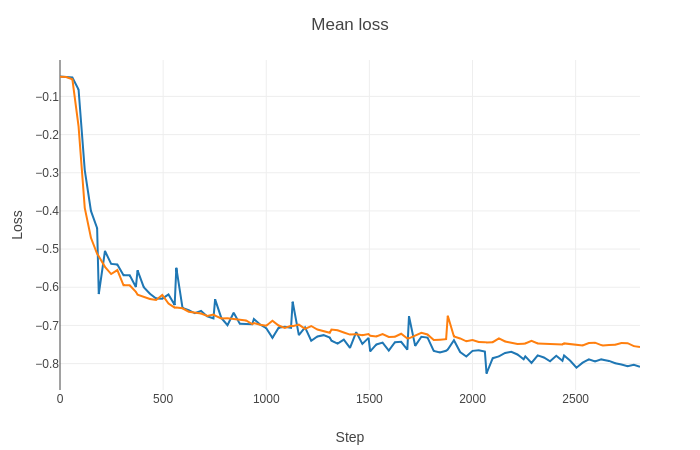
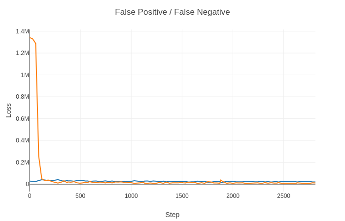
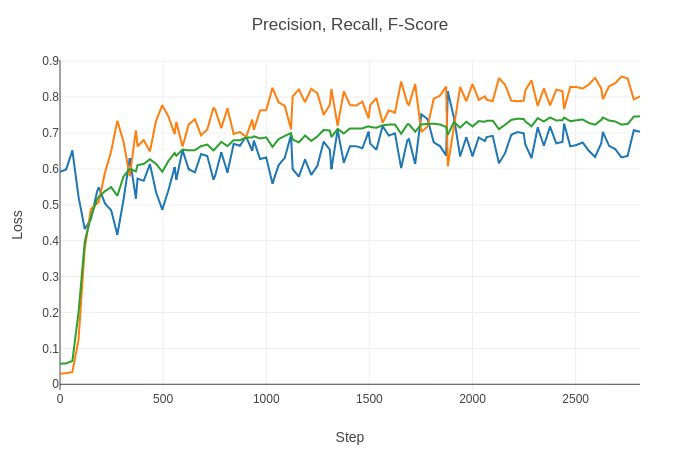

# Semantic Segmentation in PyTorch: Ultrasound Nerve Segmentation

<b>Ultrasound Nerve Segmentation</b> is a Kaggle challenge to build a model that can identify nerve structures in a dataset of ultrasound images of the neck.
The dataset in this challenge is a great resource for learning and testing semantic segmentation algorithms. Here, I use PyTorch and Keras to explore semantic segmentation on this dataset.

## Sample Results

- **Purple**: True Positive (model prediction matches nerve area marked by human)
- **Yellow**: False Negative (nodel missed nerve in the area)
- **Green**: False Positive (model incorrectlt predicted nerve in the area)


## The Data
Ultrasound images are provided as 8bit/pixel grascale, LZW compressed TIFF images of dimension 580x420. For each ultrasound image, a mask image of the same type and dimensions as the ultrasound is provided. Each mask image contains one or more manually marked areas representing location of the nerve segments (if any) in the corresponding ultrasound image.

| Ultrasound image| Label mask |
|---|---|
|  |  |
| | |

OpenCV decodes each image into a 580x420x3 numpy uint8 array. Though the image is grayscale, I retained the 3 channels as pre-trained VGG model expects 3 channel input.

For smooth down and up sampling, I cropped the images to 576x416 (multiples of 32).

I developed a tool [image-analysis.py](./image-analysis.py) to:
- Identify duplicate images, with possibly differing masks (labeling errors).
- View duplicate images and make corrections.
- Distribution of frames with and without nerve segments to help balance dataset prior to training.

### Duplicates:
Output of [image-analysis.py](./image-analysis.py)


[image-analysis.py](./image-analysis.py) works in two modes: scanning and analysis. The '-scan' option scans all data files to spot duplicates by computing image differences for every possible pair of images and stores the results in a file. In the second step, it can show side-by-side comparisons of duplicates, histogram of difference values and allow user to enter corrections.

- 63 duplicates images with difference < 100, 52 of which have mismatching masks
- 131 duplicates images with difference < 1000, 107 of which have mismatching masks

### Histogram of image differences

(log scale)


## Neural Net Architecture
VGG-16 is a fairly simple deep network that is commonly used for image segmentation. Though VGG-16 is less accurate than the larger Resnet or Inception networks and slower than Mobilenets, its simple architecture lends itself to extension by adding additional layers, introducing skip-connections, etc.

### Model


### Loss Functions and Metrics
During training the following metrics are computed after every 30 batches of training.

- IOU (Intersection over union) / [Jaccard index](https://en.wikipedia.org/wiki/Jaccard_index)
```python
def iou(y_true, y_pred):
    intersection = torch.sum(y_true * y_pred)
    return (intersection + 1.) / (torch.sum(y_true) + torch.sum(y_pred) - intersection + 1.)
```

- [Dice Coefficient](https://en.wikipedia.org/wiki/S%C3%B8rensen%E2%80%93Dice_coefficient)
```python
def dice_coef(y_true, y_pred):
    intersection = torch.sum(y_true * y_pred)
    return (2. * intersection + 1.) / (torch.sum(y_true) + torch.sum(y_pred) + 1.)
```

- [False Positive and False Negative]
```python
def falsepos(y_true, y_pred):
    intersection = torch.sum(y_true * y_pred)
    return torch.sum(y_pred) - intersection

def falseneg(y_true, y_pred):
    intersection = torch.sum(y_true * y_pred)
    return torch.sum(y_true) - intersection
```

- [Precision and Recall](https://en.wikipedia.org/wiki/Precision_and_recall)
```python
def precision(y_true, y_pred):
    intersection = torch.sum(y_true * y_pred)
    return intersection / (torch.sum(y_pred) + 1.)

def recall(y_true, y_pred):
    intersection = torch.sum(y_true * y_pred)
    return intersection / (torch.sum(y_true) + 1.)
```

- [F1-score](https://en.wikipedia.org/wiki/F1_score)
```python
def fscore(y_true, y_pred):
    presci = precision(y_true, y_pred)
    rec = recall(y_true, y_pred)
    return 2*(presci * rec)/(presci + rec)
```

- Loss function: 
  - F1-score function weighted to improve recall
  - Return negative since larger fscore is better and optimizer will push it higher
  - 
```python
def weighted_fscore_loss(weight):
    def fscore_loss(y_true, y_pred):
        presci = precision(y_true, y_pred)
        rec = recall(y_true, y_pred)
        return -(1+weight)*(presci * rec)/(weight*presci + rec)
    return fscore_loss
```

### Training

**dataset.py:**
Data set is randomly split into training and validation sets - 80% training and 20% validation.

Batches of data are transformed with [``` torchvision.transforms ```](https://pytorch.org/docs/stable/torchvision/transforms.html):
- Converting into tensors
- Normalized to values between -1 and 1 with mean 0.5 and std. dev 0.5.

**train.py:**
Batches of training data are loaded intp the GPU for computing the forward pass and getting the output of the network, calculating losses by comparing with labeled data and updating gradients in the backward pass through the loss function.

``` python
for i, (inputs, labels) in enumerate(train_loader, 0):

    # map to gpu
    inputs, labels = inputs.cuda(), labels.cuda()

    # zero the parameter gradients
    optimizer.zero_grad()

    # forward + backward + optimize
    outputs = net(inputs)
    loss = criterion(outputs, labels)
    loss.backward()
    optimizer.step()
```

Since I chose not to resize the images, I could only fit 10 images per batch in the GPU.
Resizing to smaller dimensions would have allowed larger batch sizes at the expense of precision.

At about 10 epochs of training, validation and training losses plateaued.

**Optimizer and learning rate:**

Torch offeres several [optimization](https://pytorch.org/docs/stable/optim.html) strategies, I used the popular Adam optimizer as it tends to converge quickly.
Through trial and error, I arrived at a learning rate of 1e-5. Further, I used pytorch's learning rate scheduler [ReduceLROnPlateau](https://pytorch.org/docs/stable/optim.html#torch.optim.lr_scheduler.ReduceLROnPlateau) to automatically scale the learning rate when validation starts stagnating. But in testing 10 epochs, the learning rate was not reduced.

## Evaluation
Metrics from training are sent to [Visdom](https://github.com/facebookresearch/visdom) server for visualization.

Mean Training and Validation Losses

- <span style="color:orange">Orange: Validation loss</span> 
- <span style="color:blue">Blue: Training loss</span> 

IOU and Dice Coefficient improves with training

- <span style="color:orange">Orange: IOU</span>
- <span style="color:blue">Blue: Dice coefficient</span>

False Positives and False Negatives drop

- <span style="color:orange">Orange: False negatives</span>
- <span style="color:blue">Blue: False positives</span>

Precision, Recall and F1-Score improve with training

- <span style="color:orange">Orange: Recall</span>
- <span style="color:blue">Blue: Precision</span>
- <span style="color:green">Green: F1-score</span>
