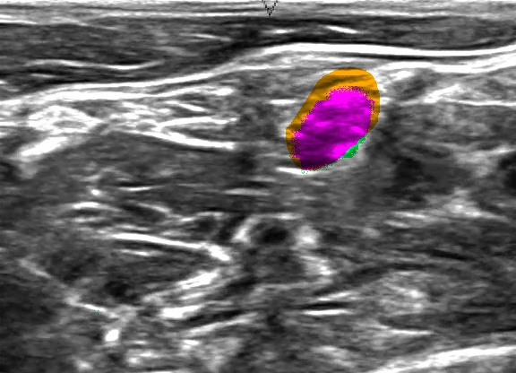

# Semantic Segmentation in PyTorch: Ultrasound Nerve Segmentation

<b>Ultrasound Nerve Segmentation</b> is a Kaggle challenge to build a model that can identify nerve structures in a dataset of ultrasound images of the neck.
The dataset in this challenge is a great resource for learning and testing semantic segmentation algorithms. Here, I use PyTorch and Keras to explore semantic segmentation on this dataset.

## Sample Results

- **Purple**: True Positive
- **Yellow**: False Negative
- **Green**: False Positive

## The Data
Ultrasound images are provided as 8bit/pixel grascale, LZW compressed TIFF images of dimension 580x420. For each ultrasound image, a mask image of the same type and dimensions as the ultrasound is provided. Each mask image contains one or more manually marked areas representing location of the nerve segments (if any) in the corresponding ultrasound image.

| Ultrasound image| Label mask |
|---|---|
|  |  |
| | |

OpenCV decodes each image into a 580x420x3 numpy uint8 array. Though the image is grayscale, I retained the 3 channels as pre-trained VGG model expects 3 channel input.

For smooth down and up sampling, I cropped the images to 576x416 (multiples of 32).

I used some python scripts to analyze the image data:
- look for duplicate images, with possibly differing masks (labeling errors).
- distribution of frames with and without nerve segments to help balance dataset prior to training.

## Neural Net Architecture
VGG-16 is a fairly simple deep network that is commonly used for image segmentation. Though VGG-16 is less accurate than the larger Resnet or Inception networks and slower than Mobilenets, its simple architecture lends itself to extension by adding additional layers, introducing skip-connections, etc.

Model

Loss Functions and Metrics

Training

Evaluation

